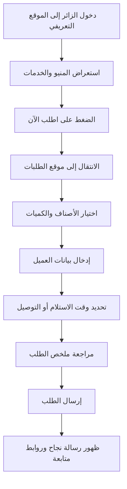

## 1. نظرة عامة على المنتج
منصة رقمية لمحل "فلافل لذة الطعام" تضم واجهتين مترابطتين: موقع تعريفي بالهوية والمنيو، وموقع طلبات مستقل بصريا يستقبل الطلبات الداخلية بدون دفع إلكتروني.
- الهدف هو عرض المنيو بشكل واضح وجذاب، وتسهيل انتقال الزائر من الاستكشاف إلى إرسال الطلب خلال دقائق.
- القيمة التجارية تتمثل في تحسين حضور المحل رقميا، جذب طلاب الجامعة والعملاء القريبين، وتقليل الاحتكاك عند تسجيل الطلبات.

## 2. الميزات الأساسية

### 2.1 الوحدات الوظيفية
1. **الموقع التعريفي**: واجهة رئيسية، نبذة عن المحل، إبراز الخدمات، عرض المنيو حسب الأقسام، دعوة واضحة للانتقال إلى موقع الطلبات.
2. **موقع الطلبات**: نموذج طلب داخلي، اختيار الأصناف والكميات، اختيار وقت الاستلام أو التوصيل، إدخال بيانات العميل، ملخص الطلب، إرسال الطلب.
3. **الربط بين الموقعين**: أزرار تنقل متبادلة، هوية بصرية مشتركة، إبراز أن كلا الواجهتين لنفس المحل.

### 2.2 تفاصيل الصفحات
| اسم الصفحة | اسم الوحدة | وصف الوظيفة |
|-----------|-------------|-------------|
| الموقع التعريفي | الواجهة الرئيسية | عرض اسم المحل، رسالة تعريفية، شارات الخدمة مثل التوصيل والسفري والجلسات، وزر انتقال إلى الطلب |
| الموقع التعريفي | أقسام المنيو | عرض السندوتشات والفطائر والصحون والبوكسات والمشروبات مع السعر والسعرات |
| الموقع التعريفي | مميزات المحل | إبراز مناسب للطلاب، فطور وعشاء، خيارات نباتية، مواقف مجانية، وإمكانية الحجز |
| الموقع التعريفي | الروابط المتقاطعة | زر "اطلب الآن" وزر "اذهب إلى صندوق الطلبات" |
| موقع الطلبات | اختيار الأصناف | بطاقات أو جدول تفاعلي لاختيار الأصناف حسب الأقسام وتحديد الكمية |
| موقع الطلبات | بيانات العميل | الاسم، رقم الجوال، نوع الخدمة، العنوان عند التوصيل، والملاحظات |
| موقع الطلبات | وقت الاستلام | اختيار تاريخ/وقت مبسط أو نافذة زمنية متاحة للاستلام أو التوصيل |
| موقع الطلبات | ملخص الطلب | حساب إجمالي العناصر والسعر، مراجعة الطلب قبل الإرسال |
| موقع الطلبات | الإرسال والتأكيد | تأكيد بصري بعد الإرسال مع إتاحة الرجوع للموقع التعريفي |

## 3. التدفق الأساسي
يبدأ المستخدم من الموقع التعريفي حيث يتعرف على المحل ويشاهد المنيو والخدمات، ثم ينتقل إلى موقع الطلبات لاختيار الأصناف المناسبة، وإدخال بياناته، وتحديد وقت الاستلام أو التوصيل، ثم يراجع الطلب ويرسله.

## 4. تصميم واجهة المستخدم
### 4.1 الأسلوب البصري
- الاتجاه العام: عربي شعبي مع لمسة حديثة منظمة تعكس محل فلافل محلي معروف وقريب من الناس.
- الألوان الأساسية: أخضر زيتوني، بيج دافئ، أحمر طوبي، ولمسات ذهبي خفيف.
- أسلوب الأزرار: حواف ناعمة متوسطة، تباين واضح، وحالات تحويم ظاهرة.
- الخطوط: عنوان عربي بطابع شعبي واضح مع خط قراءة حديث للنصوص العربية والإنجليزية.
- التخطيط: سطح غني بالمحتوى، أقسام واضحة، شرائط معلومات، وبطاقات منيو سهلة المقارنة.
- الصور: عدم الاعتماد على صور أكلات كثيرة؛ يفضل استخدام صورة أو خلفية بصرية تعبر عن هوية المحل، مع زخارف ونقوش عربية خفيفة ورسوم توضيحية بسيطة للصناديق أو الطلبات.

### 4.2 نظرة عامة على التصميم
| اسم الصفحة | اسم الوحدة | عناصر الواجهة |
|-----------|-------------|---------------|
| الموقع التعريفي | البطل الرئيسي | عنوان كبير، وصف قصير، أزرار دعوة، خلفية مزخرفة، شارات سريعة للخدمة |
| الموقع التعريفي | أقسام المنيو | بطاقات أسعار واضحة، شريط أقسام، إبراز السعرات، تمييز الأصناف الشائعة |
| الموقع التعريفي | معلومات المحل | كتل معلوماتية عن الخدمات والجو العام والمواقف والحجز |
| موقع الطلبات | رأس الصفحة | عنوان مباشر، وصف خطوات الطلب، حالة التقدم |
| موقع الطلبات | نموذج الطلب | قوائم أصناف، عدادات كمية، حقول بيانات، اختيار وقت |
| موقع الطلبات | الملخص الجانبي | إجمالي السعر، عدد العناصر، ملخص الخدمة، وزر إرسال |

### 4.3 الاستجابة
- اعتماد تصميم `Desktop-first` مع تكييف كامل للموبايل والأجهزة اللوحية.
- دعم اتجاه `RTL` للعربية مع إمكانية التحويل إلى `LTR` عند عرض الإنجليزية.
- تحسين اللمس للموبايل، خاصة في عدادات الكمية، شريط الأقسام، واختيار الوقت.

## 5. المحتوى الأساسي

### 5.1 قسم السندوتشات
| الصنف | السعرات | السعر |
|------|----------|-------|
| فلافل 4 حبات | 120 | 1 ريال |
| سندويش مشكل عادي | 431 | 4 ريال |
| سندويش مشكل فلافل بيض | 488 | 5 ريال |
| سندويش مشكل فلافل + حمص | 496 | 5 ريال |
| سندويش مشكل فلافل + جبن + بيض | 579 | 6 ريال |
| سندويش مشكل فلافل + حمص + بيض | 555 | 6 ريال |
| سندويش مشكل فلافل + حمص + بيض + جبن | 646 | 7 ريال |

### 5.2 قسم الفطائر
| الصنف | السعرات | السعر |
|------|----------|-------|
| فطيرة فلافل عادي | 771 | 8 ريال |
| فطيرة جبنتين | 862 | 9 ريال |
| فطيرة سبيشل | 919 | 10 ريال |
| فطيرة دجاج | 1141 | 13 ريال |
| فطيرة أجبان | 713 | 11 ريال |
| فطيرة جبن زعتر | 720 | 6 ريال |
| فطيرة بيض جبن | 650 | 6 ريال |

### 5.3 قسم الصحون
| الصنف | السعرات | السعر |
|------|----------|-------|
| صحن بطاطس - صغير | 248 | 4 ريال |
| صحن بطاطس - كبير | 495 | 6 ريال |
| صحن حمص | 573 | 6 ريال |
| صحن مشكل - صغير | 987 | 12 ريال |
| صحن مشكل - وسط | 1453 | 19 ريال |
| صحن مشكل - كبير | 2294 | 29 ريال |

### 5.4 قسم البوكسات
| الصنف | السعرات | السعر |
|------|----------|-------|
| بوكسات لذة عربي - 6 حبات فلافل بخبز (عادي/بر) | 1400 | 28 ريال |
| بوكسات فطائر مكس - دجاج / فلافل / بيض جبن | 2710 | 28 ريال |

### 5.5 قسم المشروبات
| الصنف | السعر | ملاحظات |
|------|-------|----------|
| مشروب غازي | 3 ريال | — |
| عصير الربيع | 2 ريال | — |
| حليب شاي | 2 ريال | — |
| شاي | 1 ريال | — |
| مياه | 1 ريال | عبوة قياسية |
| مياه | 0.5 ريال | عبوة صغيرة |
| كرك | 3 ريال | — |

## 6. متطلبات خاصة
- يجب أن يظهر في الموقع التعريفي أن المحل مناسب للفطور والعشاء، الأكل الفردي، الطلبات الخارجية، والطلاب.
- يجب إبراز الخدمات المتاحة مثل التوصيل، السفري، الجلوس، ومواقف مجانية.
- لا توجد بوابة دفع في النسخة الأولى.
- يجب أن يكون الربط بين الموقعين واضحا من أول شاشة وحتى شاشة نجاح الطلب.
