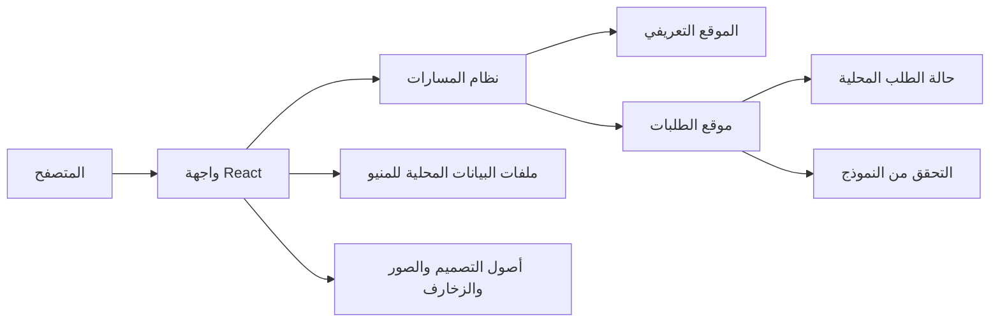

## 1. تصميم المعمارية



## 2. وصف التقنية
- الواجهة الأمامية: `React 18` + `Vite` + `TypeScript`
- التنسيق: `Tailwind CSS 3` مع طبقة متغيرات تصميم مخصصة
- التنقل: `React Router`
- إدارة الحالة: `useState` و`useMemo` و`Context` خفيف عند الحاجة
- البيانات: ملف محلي منظم للمنيو والخدمات والمميزات
- الخلفية: لا يوجد خادم في النسخة الأولى
- التخزين: تخزين محلي اختياري لآخر طلب أو اللغة المختارة عبر `localStorage`

## 3. تعريف المسارات
| المسار | الغرض |
|-------|-------|
| / | الموقع التعريفي للمحل وعرض المنيو |
| /orders | موقع استقبال الطلبات واختيار الأصناف والوقت |
| /success | شاشة تأكيد إرسال الطلب مع روابط العودة |

## 4. تعريف المكونات الرئيسية
| المكون | المسؤولية |
|--------|------------|
| `AppShell` | الإطار العام، اللغة، الاتجاه، والتنقل الرئيسي |
| `HeroSection` | إبراز اسم المحل والخدمات والهوية البصرية |
| `MenuSectionTabs` | التنقل بين أقسام المنيو |
| `MenuItemCard` | عرض الصنف مع السعر والسعرات |
| `FeaturesGrid` | عرض مزايا المحل والخدمات |
| `OrderBuilder` | اختيار الأصناف والكميات |
| `OrderForm` | إدخال بيانات العميل ونوع الخدمة والوقت |
| `OrderSummary` | تجميع الأسعار والكميات وعرض الملخص |
| `SuccessPanel` | رسالة النجاح وخطوات ما بعد الإرسال |

## 5. تعريف البيانات

### 5.1 نموذج بيانات الصنف
```ts
type MenuCategory = "sandwiches" | "pies" | "plates" | "boxes" | "drinks";

type MenuItem = {
  id: string;
  category: MenuCategory;
  nameAr: string;
  nameEn: string;
  calories?: number;
  price: number;
  descriptionAr?: string;
  descriptionEn?: string;
};
```

### 5.2 نموذج بيانات الطلب
```ts
type ServiceType = "pickup" | "delivery";

type OrderLine = {
  itemId: string;
  quantity: number;
};

type CustomerOrder = {
  customerName: string;
  phone: string;
  serviceType: ServiceType;
  pickupTime: string;
  address?: string;
  notes?: string;
  items: OrderLine[];
  totalPrice: number;
};
```

## 6. تدفق التطبيق
- يتم تحميل بيانات المنيو من ملف محلي ثابت عند بداية التطبيق.
- تعرض الصفحة الرئيسية الأقسام والخدمات مع زر انتقال واضح إلى `/orders`.
- في صفحة الطلبات يختار المستخدم الأصناف والكميات، ثم تملأ بياناته في النموذج.
- يتم احتساب الإجمالي محليا في الواجهة دون أي اتصال بخادم.
- بعد الإرسال، يتم عرض شاشة نجاح مع الاحتفاظ بملخص مبسط للطلب داخل الذاكرة أو `localStorage`.

## 7. قرارات تجربة الاستخدام
- المشروع يحتوي على تجربتين بصريتين مختلفتين لكن بهوية واحدة: الأولى تعريفية غنية، والثانية عملية ومركزة على سرعة الطلب.
- دعم العربية والإنجليزية من نفس قاعدة البيانات النصية.
- جعل التنقل بين التجربتين واضحا عبر أزرار ثابتة وروابط في التذييل والرأس.
- إعطاء أولوية لسهولة الاستخدام على الجوال لأن الطلب غالبا يتم من الهاتف.

## 8. قرارات التصميم والتنفيذ
- اعتماد طابع عربي شعبي حديث باستخدام خامات لونية دافئة، زخارف بسيطة، وواجهات واضحة.
- تقليل صور الأطعمة والاعتماد أكثر على عناصر بصرية وهوية خطية وزخرفية.
- عند الحاجة إلى صورة رئيسية، تستخدم صورة مولدة مناسبة لهوية المحل أو صورة صندوق طلب/واجهة محل، وليس صور أكلات كثيرة.
- استخدام حركات بسيطة ومدروسة: دخول تدريجي للأقسام، تفاعل واضح للأزرار، وانتقال ناعم بين الصفحات.

## 9. الاختبارات والتحقق
- اختبار يدوي للمسارات الثلاثة الأساسية.
- اختبار التبديل بين العربية والإنجليزية والاتجاه `RTL/LTR`.
- اختبار إضافة عناصر متعددة للطلب، تغيير الكميات، وحساب الإجمالي.
- اختبار سيناريوهات التوصيل والاستلام مع التحقق من الحقول المطلوبة.
